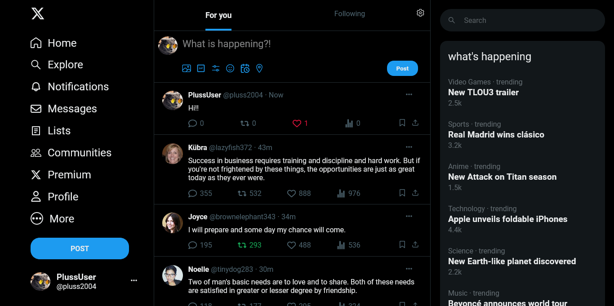

# twitter/X clone



# introduccion

Este proyecto presenta un clon de la interfaz de usuario de Twitter desarrollado con React y Sass. El objetivo es replicar la apariencia y la funcionalidad mas básica del feed original, utilizando las ventajas de estas tecnologías modernas.

# Tecnologias usadas

-React Js
-Sass
-Github Pages
-React Icons
-Vite

# API

Usuarios y fotos
[https://randomuser.me/]

Tweets
[https://github.com/lukePeavey/quotable]


# Diseño

## Iconos por: 

Font Awesome 6
[https://fontawesome.com/]

lucide
[https://lucide.dev/]

Ionicons 5
[https://ionicons.com/]

grommet
[https://github.com/grommet/grommet-icons]

Phosphor Icons
[https://github.com/phosphor-icons/core]

Remix Icon
[https://github.com/Remix-Design/RemixIcon]

Bootstrap Icons
[https://github.com/twbs/icons]

Material Design icons
[http://google.github.io/material-design-icons/]

Heroicons 2
[https://github.com/tailwindlabs/heroicons]


## Instalación

1. Clona este repositorio:

```bash
git clone https://github.com/Jlopezbedoya/X-Twitter-Clone.git
cd X-Twitter-Clone
```

2. Instalar las dependencias

```bash
npm install
```

3. Inicia la aplicación:

```bash
npm start
```